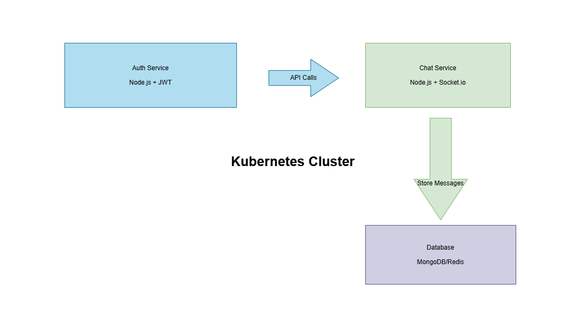

# **AutoRoy Scalable Chat 🚀**
A full DevOps × Cloud × Microservices demonstration project.

[🌐 **Live UI**](https://autoroy-chat-ui.onrender.com/)
[🟢 **Chat Service Health**](https://autoroy-chat-service.onrender.com/)
[🟢 **Auth Service Health**](https://autoroy-auth-service.onrender.com/)

A hands-on demo project showcasing how to build a **scalable real-time chat system** (Slack/Discord-style) using a separated UI + microservices backend, deployed on Render with CI/CD-ready architecture.

---

## 🧩 **Project Overview**

The system includes:

- A **login screen** using a dedicated authentication microservice
- **Display name selection** before entering the chat
- **Real-time messaging** with Socket.IO
- Support for **image messages** by sending any image URL
- **System events**, e.g.: “A user has joined the chat”
- Strict microservice separation:
- **Auth Service** → handles login & token response
- **Chat Service** → manages WebSocket (Socket.IO) communication
- **Standalone UI** → communicates with both services

The project demonstrates fundamentals of real DevOps architecture: separation of concerns, stateless services, health checks, scalable deployment, and troubleshooting.

---

## 🏗 **Architecture**



### **High-Level Flow**

- **Client (UI)**
A static site hosted on Render
- Calls `autoroy-auth-service` → `/login`
- Connects to `autoroy-chat-service` → via Socket.IO (WebSocket)

- **Auth Service**
Lightweight Node.js/Express service returning a mock token

- **Chat Service**
Node.js + Socket.IO service running a real-time chat room

- Communication is via **HTTPS + WebSocket** across independent Render services.

---

## 🛠 **Technologies Used**

### **Frontend**
- HTML, CSS, vanilla JavaScript
- Modern dark UI design with RTL support & animations
- Socket.IO client

### **Backend**
- Node.js
- Express
- Socket.IO
- CORS
- Deployed as two independent microservices on Render

### **DevOps / Cloud**
- Automatic deploys from GitHub → Render (Auto Deploy on push)
- Strict separation of UI and backend services
- Health checks for each service
- Troubleshooting real deployment issues under production-like conditions

---

## 🧭 **Roadmap & Future Improvements**

✅ Upgraded UI design with the **AutoRoy Rocket Signature**

⬜ Persistent message history (DB / Redis)

⬜ Support for multiple chat rooms

⬜ Full CI/CD pipeline (GitHub Actions → Render)

⬜ Automated testing (unit + integration)

---

## 👤 **About Me**

This project was built as part of my journey into **DevOps, Cloud Engineering, and Production-grade architecture**.

**Goal:**
Create a practical, interview-ready portfolio project that demonstrates:
- Microservice design
- Real cloud deployments
- Debugging & production troubleshooting
- Understanding of scalable system architecture

---

## 🚀 **Run Locally**

### **1. Clone the UI**

```bash
git clone https://github.com/autoroybiz-cpu/scalable-chat.git
cd scalable-chat
